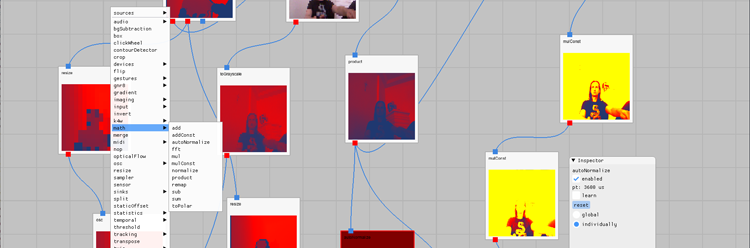
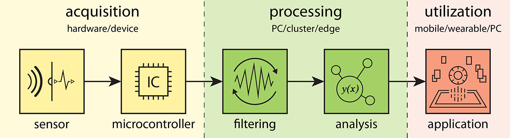
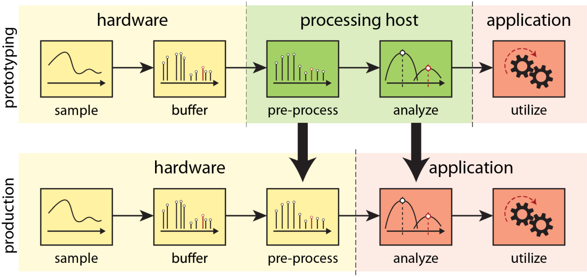
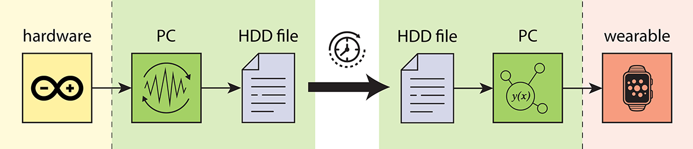

# sqıd: a Visual Programming Environment for Prototyping in HCI and UbiComp Research

sqıd is a multi-purpose tool for virtualization of data processing and relaying tasks. It is intended to simplify repetitive and time consuming tasks for prototyping and research scenarios in human computer interaction (HCI), Internet of Things (IoT), and Ubiquitous Computing (UbiComp) tedious, at least that's the initial intention it was built with. Such tasks include setting up multi-component multimedia installations, data capturing and evaluation, as well as live tuning of data processing methods for novel user interface (UI) devices or combinations thereof. It employs the visual programming (VP) paradigm to provide an accessible means for data flow programming that does not necessarily require technically skilled personnel to handle and configure.

## Concept

The primary idea is to split the entirety of the dataflow&mdash;from source device to sink&mdash;strictly into three stages, by relying mostly on networking interfaces for inter-process communication (IPC): 
- acquisition: sampling (e.g., via embedded device)
- processing: low-level filtering and/or high-level feature extraction (sqıd)
- utilization: display or control of machinery, display content, or other artifacts

Due to a nature of the data that is commonly at hand in the targeted scenarios, the IPC is building heavily on the [OSC protocol](https://opensoundcontrol.stanford.edu/) via UDP (TPC is also supported), while alternatives are also provided via optional plugins, such as MQTT and ZeroMQ (see below).

By offloading *the entirety* of sampling, filtering, and data interpretation tasks into the processing stage enables the user to virtulize this in a central application, where design of processing graph, parameter tuning, and data relaying to/from multiple devices can be done via GUI, thus operating on live data, and visually inspecting the effect of modifications immediately. 

Obviously, this is not the architecture of choice for production code, where low-level parts of the pipeline will be on hardware and more high-level tasks may be handled by the application, or some layer in between. For prototyping, and for a great range of use cases, there is arguably limited benefit from this separation; instead, it often results in tedious workflows. The sqıd approach is to devise, prototype, and tune first, and only later port parts of the finished pipeline to dedicated platforms&mdash;if this is even required.

Another frequent use case in research involves the requirement to capture data either for offline evaluation with data analysis tools or for objectively comparing different techniques on identical input data and compare based on performance metrics. sqıd supports this by the capability of capturing timed data to file (binary, CSV, MATLAB) for analysis or replay.

A sample firmware implementation for Serial (RS232) and RFCOMM (aka. Bluetooth Serial) can be found in the directory [firmware](./firmware/).

Reference implementations and templates for data sinks can be found in separate repositories for [Unity3D](https://github.com/eyeco/sqid-template-Unity3D), [Python](https://github.com/eyeco/sqid-template-Python), [Processing](https://github.com/eyeco/sqid-template-Processing), [MATLAB](https://github.com/eyeco/sqid-template-MATLAB), and [Grasshopper3D](https://github.com/eyeco/sqid-template-Grasshopper3D).

Additional notes regarding system overview and purpose can be found on the [project site](https://www.rolandaigner.com/sub/sqid.html).
A preliminary user documentation can be found in the [doc folder](./doc/main.md).

## Disclaimer

The project is a work in progress, hence, although the main features are available and the program can be (and was in numerous cases) successfully used to support numerous scenarios, the codebase it is not complete and there are features incomplete or missing. 
Since the project is a byproduct of a multi-year research endeavor in an HCI/IoT/UbiComp project, it was developed to serve the researchers' purpose and no further, due to time constraints.
When stepping through the source code, you will find passages that are marked as `TODO`, futhermore, there is a section at the bottom of this document, listing features that need implementation and/or improvement.
Unfortunately, as currently there is no funding to to do any of those, the further development is at the moment halted.

This includes not only comments and documentation in code, but also the [user documentation](./doc/main.md), which is still lacking an in-depth description of available operators (inputs, outputs, as well as processing applied to the data). Yet, most of them can be considered self-explanatory, can be figured out with some trial-and-error, or by looking at the source code, if the user exhibits some basic understanding of computer programming. In the latter case, refer to the `.cpp` files in the core module's [operators](./modules/sqidCore/src/processing/ops) code base, in particular inspect the respective class' `process()` method.

Bottom line: **use at your own discretion.** You may want to contact the author if questions arise, who will do his best to respond, depending on his momentary schedule.

### Contributing

Due to mentioned time constraints, there are aspects in both code and project configuration that are far from optimal but weren't yet addressed. In that light, collaborators are welcome; if you find the project interesting and useful and want to help improve it, don't hesitated to get in touch with the author.

## Crediting

The purpose, use cases (including intended architecture thereof), and (to some degree) usage of sqıd is elaborated in an [IEEE Pervasive Computing magazine](https://www.computer.org/csdl/magazine/pc) article, entitled [A Multipurpose Virtualization Tool, Streamlining Setups for UbiComp Research]() (2025) by Aigner et al. If you use the tool for your own research, you can show gratitude by citing the article in your own publication(s).

_TODO: add DOI, guidance for citation, add bibtex_

## Projects

The code base consists of several C++ projects: 
- apps folder
	- utils folder
		- oscListener: for debugging purposes, handy for inspecting OSC traffic
		- oscConsole: for debugging purposes
		- oscHub: utility application for routing and distributing OSC messages
		- sc: utility for monitoring serial/RS232 input
	- sqid: main application, basically wrapping the sqidCore module and loading available and configured plugins

- modules folder
	- sqidCore: core codebase
	- plugins folder
		- sqidAudio: for reading audio input
		- sqidMidi: for reading MIDI input
		- sqidMQTT: for sending and receiving messages in an MQTT network (as a client)
		- sqidTUIO2: for receiving cursor and object data using the TUIO2 protocol
		- sqidZeroMQ: ZeroMQ implementation for sending and receiving data; recommended over OSC for larger chunks

### sqıd

Basic data processing of raw sensor data (as received via OSC and numerous other sources) and sending of processed data (also via OSC) with optional graphical output.

#### modules

sqıd is using a plugin system to extend functionality that goes beyond standard operations, to (1) somewhat contain the core codebase and (2) keep the application footprint reasonably low, i.e., to avoid clutter with special purpose features and devices. These include input by certain human interface devices (HID) like Thalmic Labs' Myo, Microsoft's Kinect for Windows, LeapMotion's The Leap, and others. Those were moved to separate Git repositories. More common purpose ones are included in the main repository, such as [Audio](./modules/sqidAudio/), [MQTT](./modules/sqidMQTT/), [Midi](./modules/sqidMidi/), etc.

Usually, the sqıd executable tries to load all plugins that are co-located with the `exe` file. You can control which ones will be loaded, by modifying the `plugins` array in the `config.json` file (see section "Run", below).

Here is a complete list of sqıd plugins, some of which are public, others are not, for licensing reasons (some of which are merely not clarified; contact the author if you'd like access and he'll have a look in detail).
- [sqidAudio](./modules/sqidAudio/)
- [sqidCAN](https://github.com/eyeco/sqidCAN) (external repository, private)
- [sqidGamepad](https://github.com/eyeco/sqidGamepad) (external repository)
- [sqidKinect](https://github.com/eyeco/sqidKinect) (external repository)
- [sqidLeap](https://github.com/eyeco/sqidLeap) (external repository)
- [sqidMidi](./modules/sqidMidi/)
- [sqidMQTT](./modules/sqidMQTT/)
- [sqidMyo](https://github.com/eyeco/sqidMyo) (external repository)
- [sqidNatNet](https://github.com/eyeco/sqidNatNet) (external repository)
- [sqidOptiTrack](https://github.com/eyeco/sqidOptiTrack) (external repository)
- [sqidRealSense](https://github.com/eyeco/sqidRealSense) (external repository)
- [sqidSensel](https://github.com/eyeco/sqidSensel) (external repository)
- [sqidTUIO2](./modules/sqidTUIO2/)
- [sqidZeroMQ](./modules/sqidZeroMQ/)

#### Build

So far, only tested on windows, using MSVS 2017-2022. Configurations present for x64 platform only. Although Windows is the only supported OS so far, the codebase is written and the dependencies chosen with cross-platform capability in mind, hence, porting to Linux and MacOS should be possible with reasonable effort.

Visual Studio solution file found in [build/msvc](./build/msvc/). Use of KindDragon [Visual Leak Detector](https://kinddragon.github.io/vld/) (VLD) is highly recommended (tested with version 2.5.1). Should you decide to not use VLD, remove the definition of `__USE_VLD` from [config.h](./modules/sqidCore/include/common.h).

The built application binaries will be found in `apps/bin/<platform>/<configuration>/`, e.g., `apps/bin/x64/Release/`. Module binaries will be built into `modules/bin/<platform>/<configuration>/`, with import libraries located in `modules/libs/<platform>/<configuraton>`. Module binaries as well as their dependencies will be automatically copied into the apps directories, so executables should be able to run out-of-the-box.

Note: Support of 2D FFT (via FFTW library), compression, and RFCOMM (i.e. Bluetooth) are optional; you can deactivate them by preprocessor switches. Remove/add the respective defines `__FFTW_SUPPORT`, `__COMPRESSION_SUPPORT`, and `__RFCOMM_SUPPORT` in [config.h](./modules/sqidCore/include/config.h) accordingly. You can also build a head-less version without GUI (not just deactivating but purging all GL dependencies, e.g., for CL-only operating systems) by removing `__SUPPORT_GUI`. Note however that plugins binaries must match all of these configurations.

##### Dependencies:
General dependencies (used across modules and applications)
- OpenCV (v 3.0 upwards, tested with 4.1.0, 64 bit) [[link](https://opencv.org/)]
- cxxopts (tested with version 3.2.0, 64 bit) [[link](https://github.com/jarro2783/cxxopts)]
- glew (tested with version 2.1.0, 64 bit) [[link](http://glew.sourceforge.net/)]
- glfw (tested with version 3.3, 64 bit) [[link](https://www.glfw.org/)]
- glm (tested with version 0.9.9.3) [[link](https://github.com/g-truc/glm)]
- Dear ImGui (tested with 1.91.1) [[link](https://github.com/ocornut/imgui)]
- nlohmann json (tested with version 3.5.0) [[link](https://github.com/nlohmann/json)]
- serial (tested with version 1.2.1) [[link](https://github.com/wjwwood/serial)]
- liblo (tested with version 0.31, 64 bit) [[link](http://liblo.sourceforge.net/)]
- KindDragon Visual Leak Detector (tested with version 2.5.1) [[link](https://github.com/KindDragon/vld)]

Core module's dependencies
- bluetooth serial port [[link](https://github.com/Agamnentzar/bluetooth-serial-port)]
- clipboardXX (tested with commit [#d404c39](https://github.com/Arian8j2/ClipboardXX/tree/d404c39)) [[link](https://github.com/Arian8j2/ClipboardXX)]
- FreeType (tested with version 2.10.1, 64 bit) [[link](https://freetype.org/)]
- dlfcn-win32 (tested with version 1.4.1, 64 bit) [[link](https://github.com/dlfcn-win32/dlfcn-win32)]
- FFTW (tested with version 3.3.8, 64 bit) [[link](https://www.fftw.org/)]
- MiniLZO (tested with version 2.10, 64 bit) [[link](http://www.oberhumer.com/opensource/lzo/#minilzo)]
- QuickLZ (tested with version 1.5.0, 64 bit) [[link](http://www.quicklz.com/)]
- bzip2 (tested with version 1.0.6, 64 bit) [[link](https://www.sourceware.org/bzip2/)]
- zStd (tested with version 1.4.0, 64 bit) [[link](https://facebook.github.io/zstd/)]
- zLib (tested with version 1.2.11, 64 bit) [[link](https://zlib.net/)]
- LZ4 (tested with version 1.8.3, 64 bit) [[link](https://lz4.github.io/lz4/)]
- libjpeg-turbo (tested with version 1.5.3, 64 bit) [[link](https://libjpeg-turbo.org/)]

Included plugins' dependencies
- RtAudio (tested with 5.1.0, 64 bit) [[link](https://www.music.mcgill.ca/~gary/rtaudio/)]
- RtMidi (tested with 4.0.0, 64 bit) [[link](https://github.com/thestk/rtmidi)]
- Eclipse Mosquitto MQTT (tested with 2.0.14, 64 bit) [[link](https://mosquitto.org/)]
- TUIO 2.0 [[link](https://github.com/mkalten/TUIO20_CPP)]
- ZeroMQ (tested with 4.3.2, 64 bit) [[link](https://zeromq.org/)]

External plugins that are found in separate repositories (linked in the [modules](./modules/) folder via Git submodules) have further dependencies, which are listed in their respective repositories' README.md file.

#### Run

sqıd will currently start headless by default. Call the executable with `-g` (GUI) parameter to run it with UI. When you use to start it from the Explorer window, it is convenient to create a `.lnk` or `.bat` file, accordingly. However, since there is currently no File > Open dialog to open scene files it is more common to run it from command line, and add the scene file you want to load, e.g., `sqid.exe -g myScene`. Note you have to use `myScene` *without* JSON file extension, since the loaded information is actually split into three files, one containing the filter graph configuration (`.json`), one containing the layout on the UI canvas (`.ui.json`) and one storing the window position and size, as well as configuration, such as auto-save and view settings (`-app.ini`). The latter two are obviously irrelevant when run headless, therefore the split. Scene files will be opened (or created, if not present) relative to the current working directory, so you can also use, e.g., `../scenes/myScene`, just make sure the directory exists, as it will not be created.

Make sure the [resources](./resources/) folder is located in the current working directory when you run sqıd using the UI, otherwise TTF fonts and (potentially) shader files cannot be located by the application, causing it to shut down.

In order to control which plugins will be loaded by the application, a file `config.json` can be used, which will also be opened in the current working directory. The contained JSON string array specifies the names (without extension) of all the plugins that should be loaded. DLLs need to be co-located with the executable file. If a plugin fails to load, make sure all of its dependencies can be found by the system (a handy tool for troubleshooting is [Dependencies](https://github.com/lucasg/Dependencies)).

#### TODO's and known issues

Refer to the [list of TODOs](./TODO.md), which also includes some known issues.

### oscConsole

Console program used to send test OSC messages.

#### Build

Dependencies:
- cxxopts (tested with version 3.2.0, 64 bit) [[link](https://github.com/jarro2783/cxxopts)]
- liblo (tested with version 0.30, 64 bit) [[link](http://liblo.sourceforge.net/)]

### oscListener

Console program for OSC monitoring: prints OSC data to console window.

#### Build

Dependencies:
- cxxopts (tested with version 3.2.0, 64 bit) [[link](https://github.com/jarro2783/cxxopts)]
- liblo (tested with version 0.30, 64 bit) [[link](http://liblo.sourceforge.net/)]

## Author

Roland Aigner [[link](https://www.rolandaigner.com)]

## License

Copyright (C) 2025 eyeco

sqıd Visual Programming Environment is licensed under the GPL3 License. See LICENSE file in the package root for license information.
